## Praktikum 1: Eksperimen Tipe Data List
**Langkah 1**

Ketik atau salin kode program berikut ke dalam void main().
```
var list = [1, 2, 3];
assert(list.length == 3);
assert(list[1] == 2);
print(list.length);
print(list[1]);

list[1] = 1;
assert(list[1] == 1);
print(list[1]);
```

**Langkah 2**

Silakan coba eksekusi (Run) kode pada langkah 1 tersebut. Apa yang terjadi? Jelaskan!
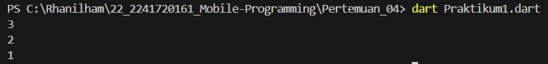
Saat kode dijalankan, pertama, program memeriksa apakah panjang list adalah 3 dan elemen kedua bernilai 2 menggunakan assert. Setelah itu, panjang list (3) dan elemen kedua (2) dicetak. Kemudian, elemen kedua diubah menjadi 1, dan program kembali memeriksa apakah perubahan berhasil. Jika semua pemeriksaan benar, elemen yang baru diubah (1) dicetak, dan program selesai tanpa error. Output akhir dari program adalah 3, 2, dan 1.

**Langkah 3**

Ubah kode pada langkah 1 menjadi variabel final yang mempunyai index = 5 dengan default value = null. Isilah nama dan NIM Anda pada elemen index ke-1 dan ke-2. Lalu print dan capture hasilnya.
```
void main() {
  final List<dynamic> list = List.filled(5, null); 

  list[1] = "Rhanilham Fadlillatul Ramadhan"; 
  list[2] = "2241720161";

  print(list);
}
```

Apa yang terjadi ? Jika terjadi error, silakan perbaiki.
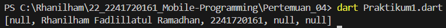
Ketika kode dijalankan, list dengan panjang 5 dan nilai default null dibuat. Kemudian, elemen pada indeks ke-1 diisi dengan nama "Rhanilham Fadlillatul Ramadhan" dan elemen indeks ke-2 diisi dengan NIM "2241720161". Saat list dicetak, hasilnya menunjukkan bahwa indeks ke-0, ke-3, dan ke-4 tetap null, sementara indeks ke-1 dan ke-2 berisi nama dan NIM yang diinput.

## Praktikum 2: Eksperimen Tipe Data Set
**Langkah 1**

Ketik atau salin kode program berikut ke dalam fungsi main().
```
var halogens = {'fluorine', 'chlorine', 'bromine', 'iodine', 'astatine'};
print(halogens);
```

**Langkah 2**

Silakan coba eksekusi (Run) kode pada langkah 1 tersebut. Apa yang terjadi? Jelaskan! Lalu perbaiki jika terjadi error.
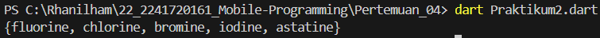
Ketika kode dijalankan, program mencetak elemen-elemen dari set halogens, yang berisi unsur-unsur kimia seperti fluorine, chlorine, bromine, iodine, dan astatine.

**Langkah 3**

Tambahkan kode program berikut, lalu coba eksekusi (Run) kode Anda.
```
var names1 = <String>{};
Set<String> names2 = {}; // This works, too.
var names3 = {}; // Creates a map, not a set.

print(names1);
print(names2);
print(names3);
```

Apa yang terjadi ? Jika terjadi error, silakan perbaiki namun tetap menggunakan ketiga variabel tersebut. Tambahkan elemen nama dan NIM Anda pada kedua variabel Set tersebut dengan dua fungsi berbeda yaitu .add() dan .addAll(). Untuk variabel Map dihapus, nanti kita coba di praktikum selanjutnya.

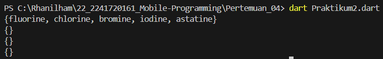
Ketika kode dijalankan, akan terjadi kesalahan pada variabel names3 karena Dart secara otomatis menganggap deklarasi {} sebagai sebuah map kosong, bukan set, karena tipe datanya tidak ditentukan. Meskipun tampilan {} sama untuk set dan map kosong, tipe data names3 adalah Map<dynamic, dynamic>, yang tidak sesuai dengan konteks set yang diinginkan. Sementara itu, names1 dan names2 adalah set kosong yang valid, sehingga dapat dicetak tanpa masalah.
```
void main() {
  var halogens = {'fluorine', 'chlorine', 'bromine', 'iodine', 'astatine'};
  print(halogens);

  // Menggunakan dua variabel set
  var names1 = <String>{};
  Set<String> names2 = {};

  // Menambahkan nama dan NIM menggunakan .add() pada names1
  names1.add('Rhanilham Fadlillatul Ramadhan');
  names1.add('2103191062');

  // Menambahkan nama dan NIM menggunakan .addAll() pada names2
  names2.addAll({'Rhanilham Fadlillatul Ramadhan', '2103191062'});

  // Mencetak hasil
  print(names1);
  print(names2);
}
```
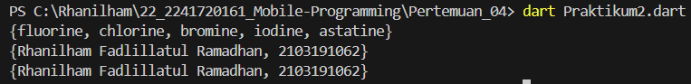

## Praktikum 3: Eksperimen Tipe Data Maps
**Langkah 1**

Ketik atau salin kode program berikut ke dalam fungsi main().
```
var gifts = {
  // Key:    Value
  'first': 'partridge',
  'second': 'turtledoves',
  'fifth': 1
};

var nobleGases = {
  2: 'helium',
  10: 'neon',
  18: 2,
};

print(gifts);
print(nobleGases);
```

**Langkah 2**

Silakan coba eksekusi (Run) kode pada langkah 1 tersebut. Apa yang terjadi? Jelaskan! Lalu perbaiki jika terjadi error.
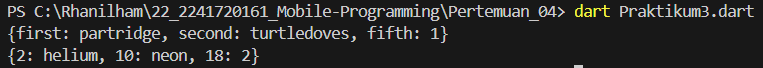
Ketika kode dijalankan, program akan mencetak dua map: gifts dan nobleGases. Map gifts berisi pasangan key-value dengan key berupa string, seperti 'first' dan 'second', serta value berupa campuran string dan angka. Map nobleGases menggunakan key berupa angka seperti 2, 10, dan 18, dengan value berupa string dan angka. Outputnya akan menunjukkan isi dari kedua map tersebut, di mana setiap key terhubung ke value yang sesuai. Karena map tidak berurutan, urutan pencetakan elemen mungkin tidak sama seperti saat dideklarasikan.
**Langkah 3**

Tambahkan kode program berikut, lalu coba eksekusi (Run) kode Anda.
```
var mhs1 = Map<String, String>();
gifts['first'] = 'partridge';
gifts['second'] = 'turtledoves';
gifts['fifth'] = 'golden rings';

var mhs2 = Map<int, String>();
nobleGases[2] = 'helium';
nobleGases[10] = 'neon';
nobleGases[18] = 'argon';
```

Apa yang terjadi ? Jika terjadi error, silakan perbaiki.
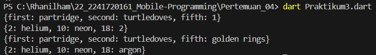
Kode di atas mendefinisikan dua peta (Map) di Dart: gifts yang berisi hadiah dengan kunci bertipe String dan nobleGases yang berisi gas mulia dengan kunci bertipe Integer. Setelah mencetak nilai awal kedua peta, kode ini memperbarui beberapa nilai di dalam peta tersebut, seperti mengubah nilai kunci 'fifth' di gifts menjadi 'golden rings' dan kunci 18 di nobleGases menjadi 'argon'. Kode kemudian mencetak kembali kedua peta untuk menampilkan hasil yang telah diperbarui.

Tambahkan elemen nama dan NIM Anda pada tiap variabel di atas (gifts, nobleGases, mhs1, dan mhs2). 
```
void main() {
  var gifts = {
    'first': 'partridge',
    'second': 'turtledoves',
    'fifth': 1,
    'nama': 'Rhanilham Fadlillatul Ramadhan',
    'NIM': '123456789'
  };

  var nobleGases = {
    2: 'helium',
    10: 'neon',
    18: 2,
    'nama': 'Rhanilham Fadlillatul Ramadhan',
    'NIM': '123456789'
  };

  print(gifts);
  print(nobleGases);

  var mhs1 = Map<String, String>();
  gifts['first'] = 'partridge';
  gifts['second'] = 'turtledoves';
  gifts['fifth'] = 'golden rings';
  mhs1['nama'] = 'Rhanilham Fadlillatul Ramadhan';
  mhs1['NIM'] = '123456789';

  var mhs2 = Map<int, String>();
  nobleGases[2] = 'helium';
  nobleGases[10] = 'neon';
  nobleGases[18] = 'argon';
  mhs2[1] = 'Rhanilham Fadlillatul Ramadhan';
  mhs2[2] = '123456789';

  print(gifts);
  print(nobleGases);
  print(mhs1);
  print(mhs2);
}
```
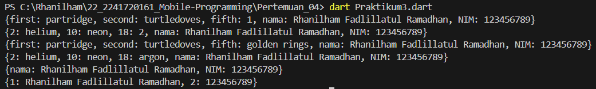

## Praktikum 4: Eksperimen Tipe Data List: Spread dan Control-flow Operators
**Langkah 1**

Ketik atau salin kode program berikut ke dalam fungsi main().
```
var list = [1, 2, 3];
var list2 = [0, ...list];
print(list1);
print(list2);
print(list2.length);
```

**Langkah 2**

Silakan coba eksekusi (Run) kode pada langkah 1 tersebut. Apa yang terjadi? Jelaskan! Lalu perbaiki jika terjadi error.
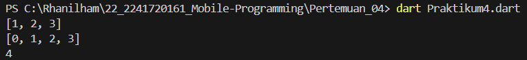
Kode tersebut membuat dua daftar: list yang berisi [1, 2, 3] dan list2 yang menggunakan spread operator (...) untuk menyisipkan elemen-elemen dari list, sehingga list2 menjadi [0, 1, 2, 3]. Kemudian, kode mencetak isi dari list, isi dari list2, dan panjang list2, yang hasilnya menunjukkan bahwa list memiliki 3 elemen, list2 memiliki 4 elemen, dan panjang list2 adalah 4.

**Langkah 3**

Tambahkan kode program berikut, lalu coba eksekusi (Run) kode Anda.
```
list1 = [1, 2, null];
print(list1);
var list3 = [0, ...?list1];
print(list3.length);
```

Apa yang terjadi ? Jika terjadi error, silakan perbaiki.
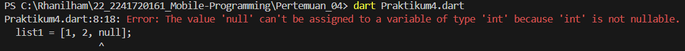
```
void main() {
  var list1 = [1, 2, 3];
  var list2 = [0, ...list1];
  print(list1);
  print(list2);
  print(list2.length);

  List<int?> list1Nullable = [1, 2, null];
  print(list1Nullable);
  var list3 = [0, ...?list1Nullable];
  print(list3.length);
}
```
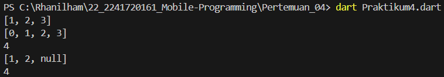
Tambahkan variabel list berisi NIM Anda menggunakan Spread Operators. Dokumentasikan hasilnya dan buat laporannya!
```
void main() {
  var list1 = [1, 2, 3];
  var list2 = [0, ...list1];
  print(list1);
  print(list2);
  print(list2.length);

  List<int?> list1Nullable = [1, 2, null];
  print(list1Nullable);
  var list3 = [0, ...?list1Nullable];
  print(list3.length);

  var listNIM = [0, ...[2, 2, 4, 1, 7, 2, 0, 1, 6, 1]]; 
  print(listNIM);
}
```
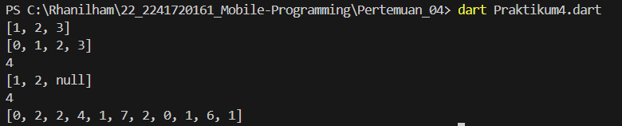

**Langkah 4**

Tambahkan kode program berikut, lalu coba eksekusi (Run) kode Anda.
```
var nav = ['Home', 'Furniture', 'Plants', if (promoActive) 'Outlet'];
print(nav);
```

Apa yang terjadi ? Jika terjadi error, silakan perbaiki. Tunjukkan hasilnya jika variabel promoActive ketika true dan false.
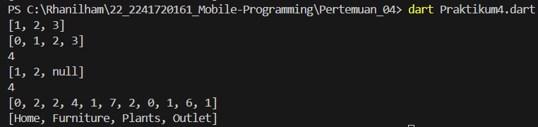
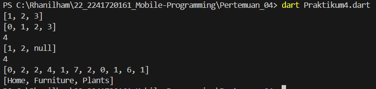

**Langkah 5**

Tambahkan kode program berikut, lalu coba eksekusi (Run) kode Anda.
```
var nav2 = ['Home', 'Furniture', 'Plants', if (login case 'Manager') 'Inventory'];
print(nav2);
```

Apa yang terjadi ? Jika terjadi error, silakan perbaiki. Tunjukkan hasilnya jika variabel login mempunyai kondisi lain.
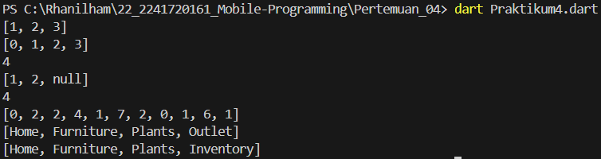

**Langkah 6**

Tambahkan kode program berikut, lalu coba eksekusi (Run) kode Anda.
```
var listOfInts = [1, 2, 3];
var listOfStrings = ['#0', for (var i in listOfInts) '#$i'];
assert(listOfStrings[1] == '#1');
print(listOfStrings);
```

Apa yang terjadi ? Jika terjadi error, silakan perbaiki. Jelaskan manfaat Collection For dan dokumentasikan hasilnya.
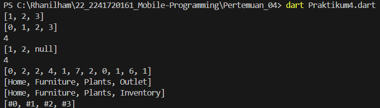

## Praktikum 5: Eksperimen Tipe Data Records
**Langkah 1**

Ketik atau salin kode program berikut ke dalam fungsi main().
```
var record = ('first', a: 2, b: true, 'last');
print(record)
```

**Langkah 2**

Silakan coba eksekusi (Run) kode pada langkah 1 tersebut. Apa yang terjadi? Jelaskan! Lalu perbaiki jika terjadi error.
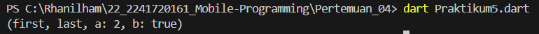
Ketika kode dijalankan, Dart akan mendefinisikan sebuah tuple record yang berisi dua elemen posisi ('first' dan 'last') serta dua elemen bernama (a: 2 dan b: true). Saat mencetak record, hasilnya akan menampilkan semua elemen dalam format (first, a: 2, b: true, last), mengelompokkan data heterogen dalam satu struktur terorganisir.

**Langkah 3**

Tambahkan kode program berikut di luar scope void main(), lalu coba eksekusi (Run) kode Anda.
```
(int, int) tukar((int, int) record) {
  var (a, b) = record;
  return (b, a);
}
```

Apa yang terjadi ? Jika terjadi error, silakan perbaiki. Gunakan fungsi tukar() di dalam main() sehingga tampak jelas proses pertukaran value field di dalam Records.
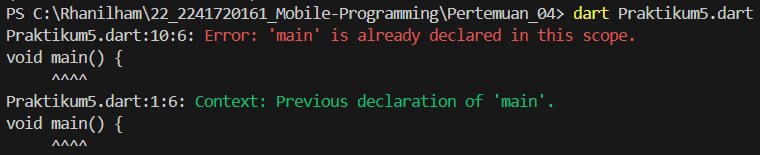
```
(int, int) tukar((int, int) record) {
  var (a, b) = record;
  return (b, a);
}

void main() {
  var record = (1, 2); 
  print('Record sebelum ditukar: $record');
  
  var hasilTukar = tukar(record); 
  print('Record setelah ditukar: $hasilTukar');
}
```
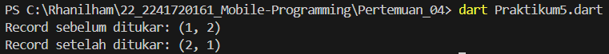

**Langkah 4**

Tambahkan kode program berikut di dalam scope void main(), lalu coba eksekusi (Run) kode Anda.
```
// Record type annotation in a variable declaration:
(String, int) mahasiswa;
print(mahasiswa);
```

Apa yang terjadi ? Jika terjadi error, silakan perbaiki. Inisialisasi field nama dan NIM Anda pada variabel record mahasiswa di atas. Dokumentasikan hasilnya dan buat laporannya!
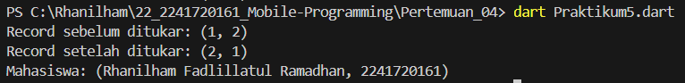

**Langkah 5**

Tambahkan kode program berikut di dalam scope void main(), lalu coba eksekusi (Run) kode Anda.
```
var mahasiswa2 = ('first', a: 2, b: true, 'last');

print(mahasiswa2.$1); // Prints 'first'
print(mahasiswa2.a); // Prints 2
print(mahasiswa2.b); // Prints true
print(mahasiswa2.$2); // Prints 'last'
```

Apa yang terjadi ? Jika terjadi error, silakan perbaiki. Gantilah salah satu isi record dengan nama dan NIM Anda, lalu dokumentasikan hasilnya dan buat laporannya!
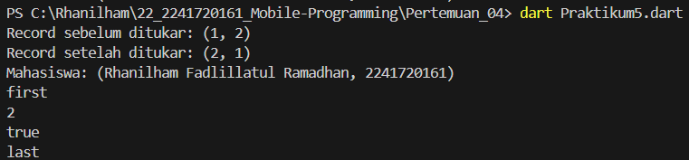
## Tugas Praktikum
1. Silakan selesaikan Praktikum 1 sampai 5, lalu dokumentasikan berupa screenshot hasil pekerjaan Anda beserta penjelasannya!
2. Jelaskan yang dimaksud Functions dalam bahasa Dart!

    Dalam bahasa Dart, functions (fungsi) adalah blok kode yang dirancang untuk melakukan tugas tertentu. Fungsi memungkinkan kita untuk mengorganisir kode dengan cara yang modular dan dapat digunakan kembali. Dengan menggunakan fungsi, kita dapat mengeksekusi sekelompok pernyataan dengan satu panggilan.

3. Jelaskan jenis-jenis parameter di Functions beserta contoh sintaksnya!

    I. **Parameter Posisi**
      - Harus diberikan urutan saat fungsi dipanggil.
      - **Contoh:**
        ```dart
        void printDetails(String name, int age) {}
        ```

    II. **Parameter Opsional**
      - Tidak perlu diberikan saat memanggil fungsi.
      - A. **Parameter Opsional Berbasis Posisi**
        - Ditandai dengan tanda kurung siku `[]`.
        - **Contoh:**
          ```dart
          void printInfo(String name, [int age]) {}
          ```
      - B. **Parameter Opsional Berbasis Nama**
        - Ditandai dengan kurung kurawal `{}`. Bisa memiliki nilai default.
        - **Contoh:**
          ```dart
          void displayInfo(String name, {int age = 0}) {}
          ```

    III. **Parameter Default**
      - Parameter opsional yang memiliki nilai default.
      - **Contoh:**
        ```dart
        void greet({String greeting = 'Hello'}) {}
        ```

    IV. **Parameter `required`**
      - Menandai parameter opsional berbasis nama yang wajib diisi.
      - **Contoh:**
        ```dart
        void showDetails({required String name}) {}
        ```

4. Jelaskan maksud Functions sebagai first-class objects beserta contoh sintaknya!

    Dalam Dart, **fungsi sebagai first-class objects** berarti bahwa fungsi diperlakukan seperti objek lainnya. Ini memungkinkan Anda untuk:

    1. **Menyimpan fungsi dalam variabel.**
    2. **Mengirim fungsi sebagai argumen ke fungsi lain.**
    3. **Mengembalikan fungsi dari fungsi.**

    ### Ciri-ciri Fungsi Sebagai First-Class Objects

    I. **Dapat Disimpan dalam Variabel**
      - Anda dapat menyimpan fungsi dalam variabel.
      - **Contoh:**
        ```dart
        void greet() {
          print('Hello, World!');
        }

        void main() {
          var greeting = greet; // Menyimpan fungsi dalam variabel
          greeting(); // Memanggil fungsi melalui variabel
        }
        ```

    II. **Dapat Dikirim Sebagai Argumen**
      - Fungsi dapat diteruskan sebagai argumen ke fungsi lain.
      - **Contoh:**
        ```dart
        void sayHello() {
          print('Hello!');
        }

        void executeFunction(Function func) {
          func(); // Memanggil fungsi yang diteruskan
        }

        void main() {
          executeFunction(sayHello); // Mengirim fungsi sebagai argumen
        }
        ```

    III. **Dapat Mengembalikan Fungsi**
      - Fungsi dapat mengembalikan fungsi lain sebagai hasil.
      - **Contoh:**
        ```dart
        Function createMultiplier(int factor) {
          return (int value) => value * factor; // Mengembalikan fungsi
        }

        void main() {
          var double = createMultiplier(2); // Membuat fungsi pengali
          print(double(5)); // Output: 10
        }
        ```

5. Apa itu Anonymous Functions? Jelaskan dan berikan contohnya!

    Anonymous functions (fungsi anonim) dalam Dart adalah fungsi yang tidak memiliki nama. Fungsi ini sering digunakan untuk keperluan tertentu, seperti fungsi callback atau fungsi yang hanya perlu digunakan sekali. Anonymous functions sangat berguna dalam konteks pemrograman fungsional dan ketika Anda memerlukan fungsi sederhana tanpa harus mendefinisikan fungsi secara terpisah.

6. Jelaskan perbedaan Lexical scope dan Lexical closures! Berikan contohnya!

    ### Lexical Scope
    Lexical Scope adalah aturan yang menentukan cara pengambilan variabel dalam suatu fungsi berdasarkan lokasi di mana fungsi tersebut didefinisikan. Dalam lexical scope, fungsi dapat mengakses variabel yang dideklarasikan di dalam lingkup (scope) di mana fungsi tersebut didefinisikan, termasuk variabel di luar fungsi (parent scope).

    Contoh Lexical Scope
    ```
    dart
    Copy code
    void outerFunction() {
      String outerVariable = 'I am outside!';

      void innerFunction() {
        print(outerVariable); // Mengakses variabel dari parent scope
      }

      innerFunction();
    }

    void main() {
      outerFunction(); // Output: I am outside!
    }
    ``` 
    ### Lexical Closures
    Lexical Closures adalah fungsi yang mengingat lingkungan (environment) di mana ia diciptakan, termasuk variabel-variabel dalam scope saat fungsi tersebut dibuat. Closure memungkinkan fungsi untuk terus mengakses variabel yang didefinisikan di luar fungsi, bahkan setelah fungsi tersebut dieksekusi di luar scope-nya.

    Contoh Lexical Closures
    ```
    dart
    Copy code
    Function makeCounter() {
      int count = 0; // Variabel privat

      return () {
        count++; // Mengakses dan memodifikasi variabel privat
        return count;
      };
    }

    void main() {
      var counter = makeCounter();
      print(counter()); // Output: 1
      print(counter()); // Output: 2
      print(counter()); // Output: 3
    }
    ```

7. Jelaskan dengan contoh cara membuat return multiple value di Functions!

    1. Menggunakan List
    Kamu bisa mengembalikan beberapa nilai dalam bentuk list. Berikut adalah contohnya:
    ```
    dart
    Copy code
    List<int> hitung(int a, int b) {
      int jumlah = a + b;
      int selisih = a - b;
      return [jumlah, selisih]; // Mengembalikan list yang berisi jumlah dan selisih
    }

    void main() {
      var hasil = hitung(10, 5);
      print('Jumlah: ${hasil[0]}, Selisih: ${hasil[1]}');
    }
    ```

    2. Menggunakan Objek
    Kamu bisa membuat kelas untuk mengelompokkan beberapa nilai dan mengembalikannya sebagai objek.
    ```
    dart
    Copy code
    class Hasil {
      int jumlah;
      int selisih;

      Hasil(this.jumlah, this.selisih);
    }

    Hasil hitung(int a, int b) {
      int jumlah = a + b;
      int selisih = a - b;
      return Hasil(jumlah, selisih); // Mengembalikan objek Hasil
    }

    void main() {
      var hasil = hitung(10, 5);
      print('Jumlah: ${hasil.jumlah}, Selisih: ${hasil.selisih}');
    }
    ```

    3. Menggunakan Tuple (Menggunakan Paket)
    Dart tidak memiliki tipe data tuple secara bawaan, tetapi kamu bisa menggunakan paket tuple untuk mencapainya.
    ```
    dart
    Copy code
    import 'package:tuple/tuple.dart';

    Tuple2<int, int> hitung(int a, int b) {
      int jumlah = a + b;
      int selisih = a - b;
      return Tuple2(jumlah, selisih); // Mengembalikan tuple
    }

    void main() {
      var hasil = hitung(10, 5);
      print('Jumlah: ${hasil.item1}, Selisih: ${hasil.item2}');
    }
    ````

8. Kumpulkan berupa link commit repo GitHub pada tautan yang telah disediakan di grup Telegram!