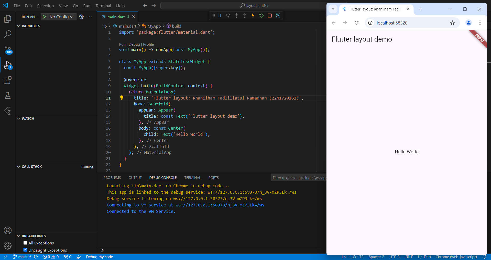
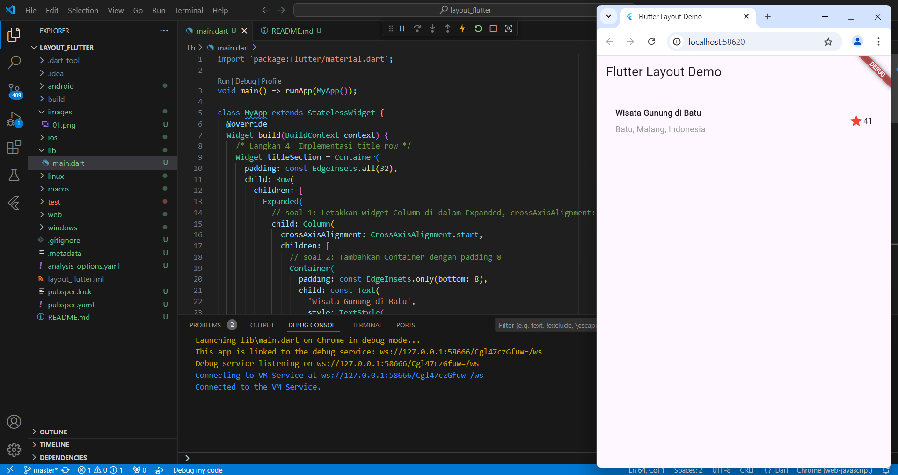
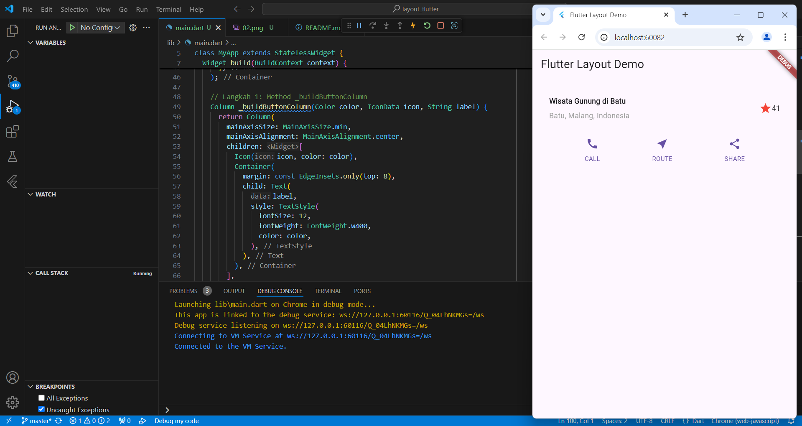
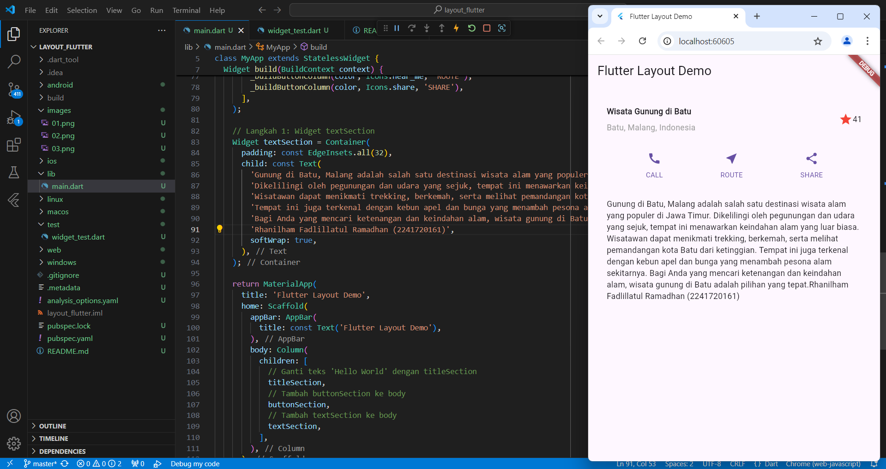
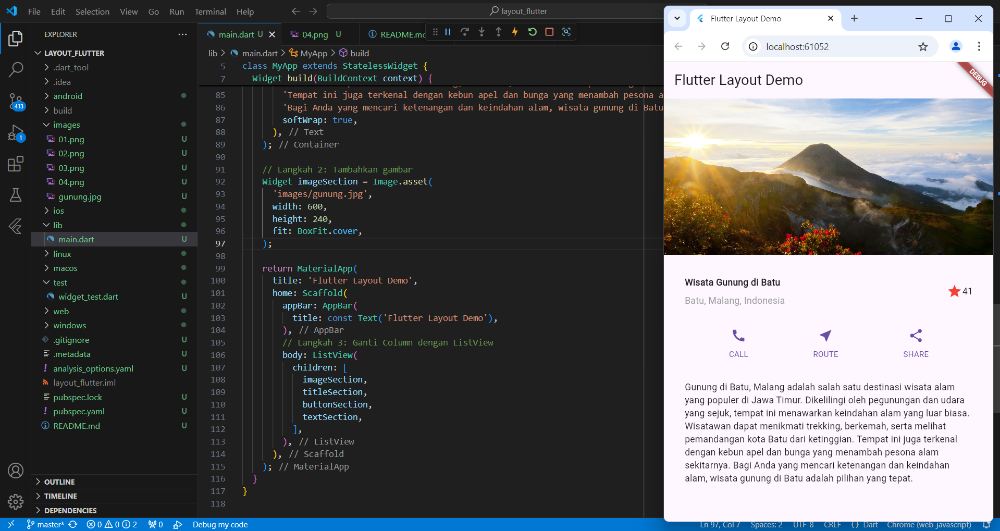

## Praktikum 1: Membangun Layout di Flutter
**Langkah 1: Buat Project Baru**

**Langkah 2: Buka file lib/main.dart**

**Langkah 3: Identifikasi layout diagram**

**Langkah 4: Implementasi title row**

## Praktikum 2: Implementasi Button Row
**Langkah 1: Buat method Column _buildButtonColumn**

**Langkah 2: Buat widget buttonSection**

**Langkah 3: Tambah button section ke body**

## Praktikum 3: Implementasi Text Section
**Langkah 1: Buat widget textSection**

**Langkah 2: Tambahkan variabel text section ke body**

## Praktikum 4: Implementasi Image Section
**Langkah 1: Siapkan aset gambar**

**Langkah 2: Tambahkan gambar ke body**

**Langkah 3: Terakhir, ubah menjadi ListView**

