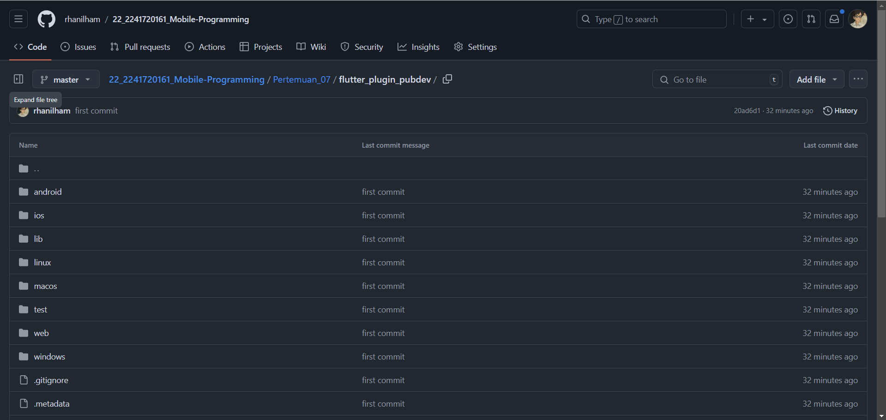
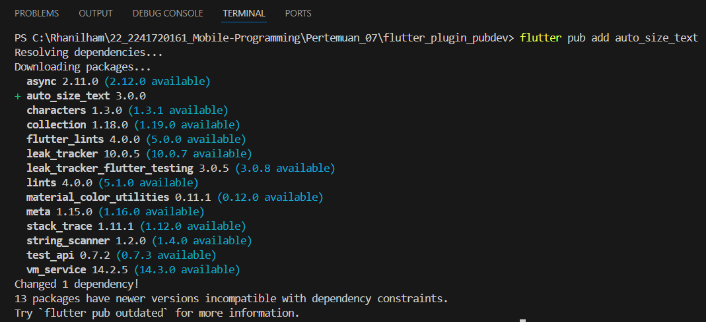
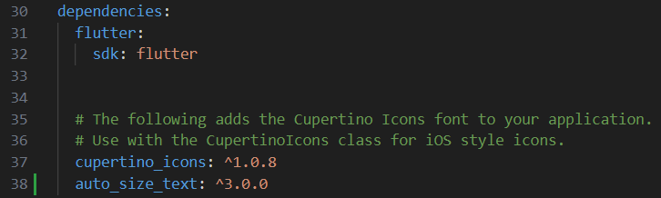
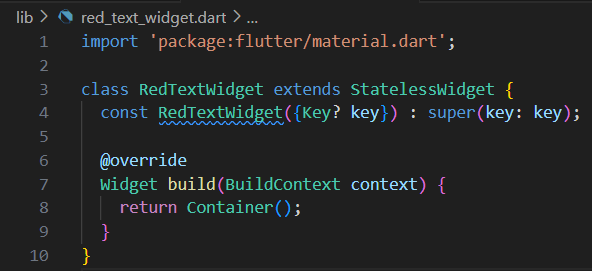
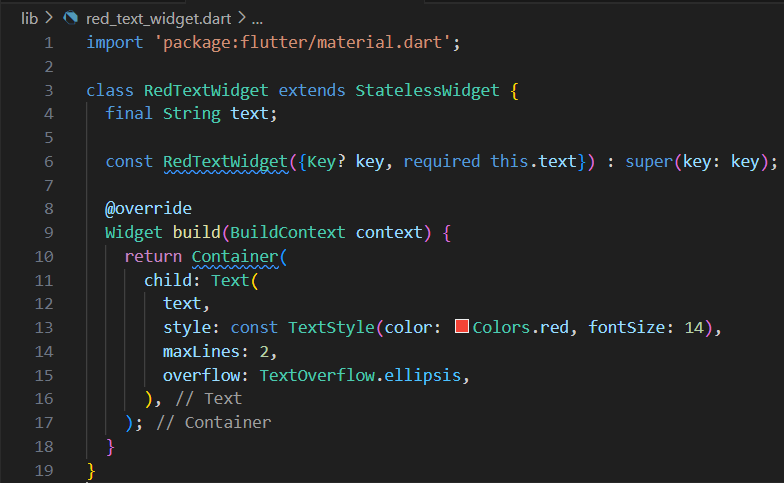
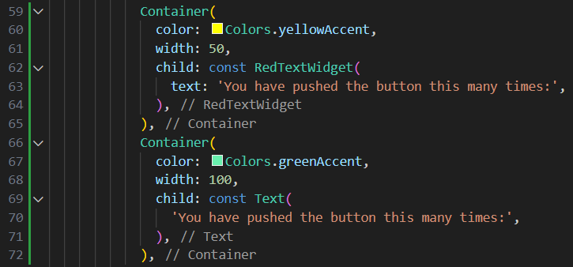
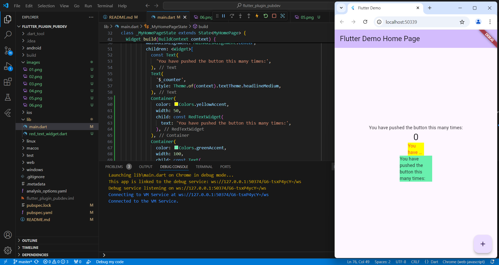

## Praktikum Menerapkan Plugin di Project Flutter
**Langkah 1: Buat Project Baru**

Buatlah sebuah project flutter baru dengan nama flutter_plugin_pubdev. Lalu jadikan repository di GitHub Anda dengan nama flutter_plugin_pubdev.


**Langkah 2: Menambahkan Plugin**

Tambahkan plugin auto_size_text menggunakan perintah berikut di terminal
```
flutter pub add auto_size_text
```


Jika berhasil, maka akan tampil nama plugin beserta versinya di file pubspec.yaml pada bagian dependencies.



**Langkah 3: Buat file red_text_widget.dart**

Buat file baru bernama red_text_widget.dart di dalam folder lib lalu isi kode seperti berikut.
```
import 'package:flutter/material.dart';

class RedTextWidget extends StatelessWidget {
  const RedTextWidget({Key? key}) : super(key: key);

  @override
  Widget build(BuildContext context) {
    return Container();
  }
}
```


**Langkah 4: Tambah Widget AutoSizeText**

Masih di file red_text_widget.dart, untuk menggunakan plugin auto_size_text, ubahlah kode return Container() menjadi seperti berikut.
```
return AutoSizeText(
      text,
      style: const TextStyle(color: Colors.red, fontSize: 14),
      maxLines: 2,
      overflow: TextOverflow.ellipsis,
);
```
Setelah Anda menambahkan kode di atas, Anda akan mendapatkan info error. Mengapa demikian? Jelaskan dalam laporan praktikum Anda!

Karena komponen Container tidak bisa langsung menerima teks sebagai parameter, dan properti seperti style, maxLines, dan overflow adalah bagian dari widget Text, bukan Container. Berikut kode yang sudah dikoreksi:

**Langkah 5: Buat Variabel text dan parameter di constructor**

Tambahkan variabel text dan parameter di constructor seperti berikut.
```
final String text;

const RedTextWidget({Key? key, required this.text}) : super(key: key);
```


**Langkah 6: Tambahkan widget di main.dart**

Buka file main.dart lalu tambahkan di dalam children: pada class _MyHomePageState
```
Container(
   color: Colors.yellowAccent,
   width: 50,
   child: const RedTextWidget(
             text: 'You have pushed the button this many times:',
          ),
),
Container(
    color: Colors.greenAccent,
    width: 100,
    child: const Text(
           'You have pushed the button this many times:',
          ),
),
```


Run aplikasi tersebut dengan tekan F5, maka hasilnya akan seperti berikut.


## Tugas Praktikum
1. Selesaikan Praktikum tersebut, lalu dokumentasikan dan push ke repository Anda berupa screenshot hasil pekerjaan beserta penjelasannya di file README.md!

2. Jelaskan maksud dari langkah 2 pada praktikum tersebut!

    Langkah 2 menambahkan plugin auto_size_text ke proyek Flutter, yang berfungsi untuk menyesuaikan ukuran teks agar sesuai dengan ruang yang tersedia di tampilan. Perintah flutter pub add auto_size_text akan menambahkan plugin ini ke dalam berkas pubspec.yaml, sehingga dapat digunakan dalam aplikasi untuk membuat teks lebih responsif.

3. Jelaskan maksud dari langkah 5 pada praktikum tersebut!

   Langkah 5 bertujuan untuk menambahkan variabel text sebagai bagian dari widget RedTextWidget, sehingga widget ini bisa menerima nilai teks dari luar saat digunakan. Variabel text ditandai sebagai parameter wajib dalam konstruktor, artinya setiap kali widget ini dipanggil, teks harus disediakan. Hal ini memudahkan untuk menampilkan teks yang spesifik sesuai kebutuhan aplikasi langsung di dalam widget.

4. Pada langkah 6 terdapat dua widget yang ditambahkan, jelaskan fungsi dan perbedaannya!

    Pada langkah 6, RedTextWidget dan Text digunakan untuk menampilkan teks, namun dengan perbedaan fungsi. RedTextWidget adalah widget kustom yang memungkinkan penyesuaian tampilan teks sesuai kebutuhan, sedangkan Text adalah widget bawaan Flutter yang hanya menampilkan teks secara langsung tanpa modifikasi tambahan. Kedua widget ini ditempatkan dalam Container dengan warna latar berbeda untuk menunjukkan perbedaan penggunaannya dalam tampilan aplikasi.
5. Jelaskan maksud dari tiap parameter yang ada di dalam plugin auto_size_text berdasarkan tautan pada dokumentasi ini!

    Di dalam plugin auto_size_text, beberapa parameter penting meliputi:

    + minFontSize/maxFontSize: Menentukan rentang ukuran font untuk penyesuaian otomatis.
    + maxLines: Membatasi jumlah maksimum baris teks.
    stepGranularity: Mengatur langkah ukuran font saat penyesuaian.
    + presetFontSizes: Menentukan ukuran font tertentu untuk dicoba.
    + overflowReplacement: Mengganti teks jika tidak dapat muat dalam ruang.
    + group: Menyinkronkan ukuran font pada beberapa widget AutoSizeText agar seragam.

6. Kumpulkan laporan praktikum Anda berupa link repository GitHub kepada dosen!